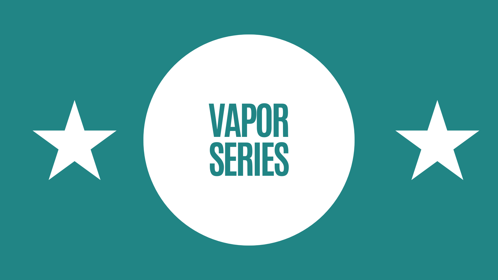

# Vapor Series Demo Server

This repository contains the demo server application used in the YouTube video series about Vapor, a server-side Swift web framework. The project demonstrates various aspects of building backend applications with Vapor, with a particular focus on content handling and data processing.

## 📺 Watch the Series!

[](https://www.youtube.com/watch?v=PF64Emosfs4&list=PL9UNszxz2Q2e7as86UF2MX8s1v7IB7EYf)

> 🎬 **[Watch the Complete Vapor Series on YouTube](https://www.youtube.com/watch?v=PF64Emosfs4&list=PL9UNszxz2Q2e7as86UF2MX8s1v7IB7EYf)**
>
> Subscribe to **[Swift Nuggets with Radu Dan](https://www.youtube.com/@radude89)** for more Swift and Vapor tutorials!

## 🎯 Featured Topics

- Content System in Vapor
- Codable Models
- JSON Encoding/Decoding
- Custom Content Types
- URL Query Parameters
- Content Configuration
- Hooks Implementation

## 🚀 Getting Started

### Prerequisites

- [Xcode](https://developer.apple.com/xcode/) (You can download it from the App Store or use [Xcodes App](https://www.xcodes.app/))
- [Homebrew](https://brew.sh/)
- [Vapor](https://docs.vapor.codes/install/macos/)

### Installation

1. Clone the repository:
```bash
git clone https://github.com/radude89/vapor-series.git
cd vapor-series
```

2. Open `Package.swift` and run the project from Xcode.

The server will start running on `localhost:8080` by default.

## 📚 Documentation

For more detailed information about Vapor and its features, check out:
- [Vapor Documentation](https://docs.vapor.codes/)
- [Content API Documentation](https://docs.vapor.codes/basics/content/)

## 🎥 Video Series

This demo is part of a comprehensive video series about Vapor development. Each episode is carefully crafted to help you master server-side Swift development with Vapor.

### What You'll Learn
- Deep dive into Vapor's Content system
- Efficient data decoding techniques
- URL query parameter handling
- Content configuration and hooks
- Practical, hands-on demonstrations
- Best practices and pro tips

### Latest Episodes
- [Content System in Vapor](https://www.youtube.com/watch?v=PF64Emosfs4&list=PL9UNszxz2Q2e7as86UF2MX8s1v7IB7EYf) - Learn about Codable models and JSON handling
- More episodes coming soon!

> 💡 **Pro Tip**: Subscribe to the channel and enable notifications to stay updated with the latest episodes!

## 🛠 Tools Used

- [Vapor](https://vapor.codes) - Server-side Swift framework
- [Postman](https://www.postman.com/) - API testing
- [Swift](https://swift.org) - Programming language

## 👨‍💻 Author

**Radu Dan**
- Website: [radude89.com](https://www.radude89.com/)
- Blog: [Medium](https://radu-ionut-dan.medium.com/)
- LinkedIn: [Radu Dan](https://www.linkedin.com/in/radu-dan-b0182349/)
- Twitter: [@radude89](https://twitter.com/radude89)

## 📄 License

This project is licensed under the MIT License - see the [LICENSE](LICENSE) file for details.
